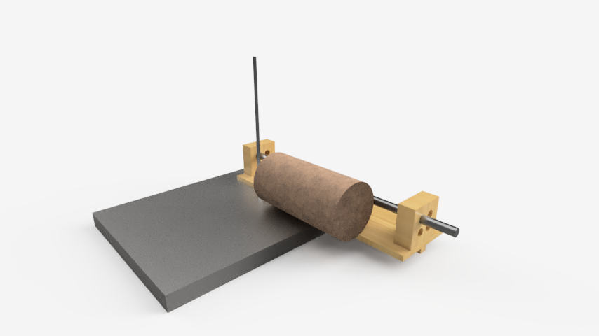
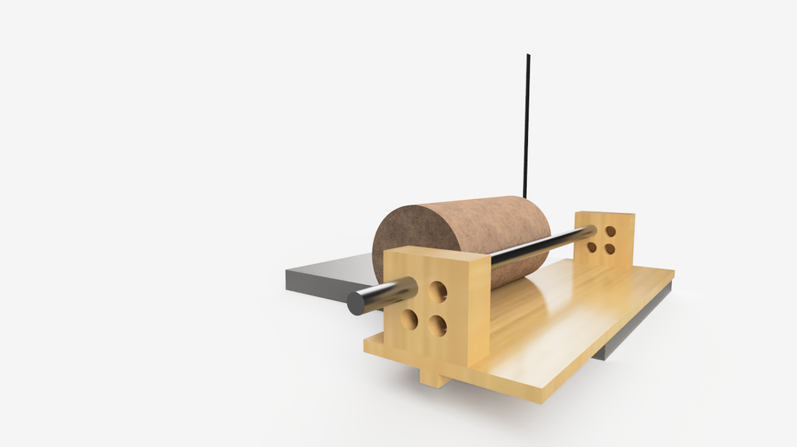

# fusion-360-laguna-14bx-bandsaw-log-jig

AutoDesk Fusion 360 plans for a bandsaw sled/jig to cut round logs.

The dimensions of the bandsaw table in this project were based on measurements taken from my Laguna 14BX bandsaw. In inches, they are: 

* Table width = 21.25"
* Table depth = 16"
* Table Thickness = 1.4375"
* Miter width = 0.75"
* Right miter edge from right table edge = 3.125"
* Left miter edge to right edge of bandsaw blade = 3.5"
* Front of table to (approx) center of bandsaw blade = 8"
* Resaw capacity = 12"

# Background

Try cutting a round log on a bandsaw and you're taking a risk that the blade bites and twists/spins the wood. This can damage the workpiece, tool, or you.

This is a jig in which you would secure a round log so that it cannot rotate while you make your first cut. Once you have a first cut, you can remove the log from the jig and use a regular bandsaw fence, or you can continue to make additional passes with the jig. 

There are quite a few similar project ideas on blogs and YouTube, but this design is most heavily influenced by the example shown at https://smallboatsmonthly.com/article/log-milling-sled/

# Notes

This is my first project with AutoDesk Fusion 360. This isn't a great plan (and currently still a work in process).

## Shoutout

My *very* first exposure to anything like this was through the really cool Udemy course, [**Fusion 360 for Woodworkers**](https://www.udemy.com/share/101YGAAEITdlpRTHQF/). At the time I built this project, I had only made it about ~1/2 through the course and was so excited I had to pause it and go build my own project. Highly recommend the course for any woodworker that wants to learn to use 3D modelling software. Note - I have no affiliation to the course author and do not receive any form of compensation for this recommendation.

# Design

In the photos below, the metal rod represents a 3/4 steel pipe which would have a pipe clamp installed. The four holes exist so you can reposition the pipe as log dimensions change. 

Being able to change jig and log dimensions on the fly has been super helpful! For example, as I play with various log dimensions, I realize that the four pipe positioning holes in the block (1.5x3.5x3.5 as pictured) might not accomodate an acceptable range of log dimensions. 

I would either need to make wider (and possibly, taller) and taller fence walls with additional holes or make the fence walls movable. An example of a movable base using screws and wing nuts is shown here: 

https://www.woodworkweb.com/woodworking-videos-1/woodworking-jigs-projects/779-make-a-bandsaw-short-log-mill-jig.html

# Construction Plans

I need to learn to use Fusion 360 to generate a proper set of "build plans".
